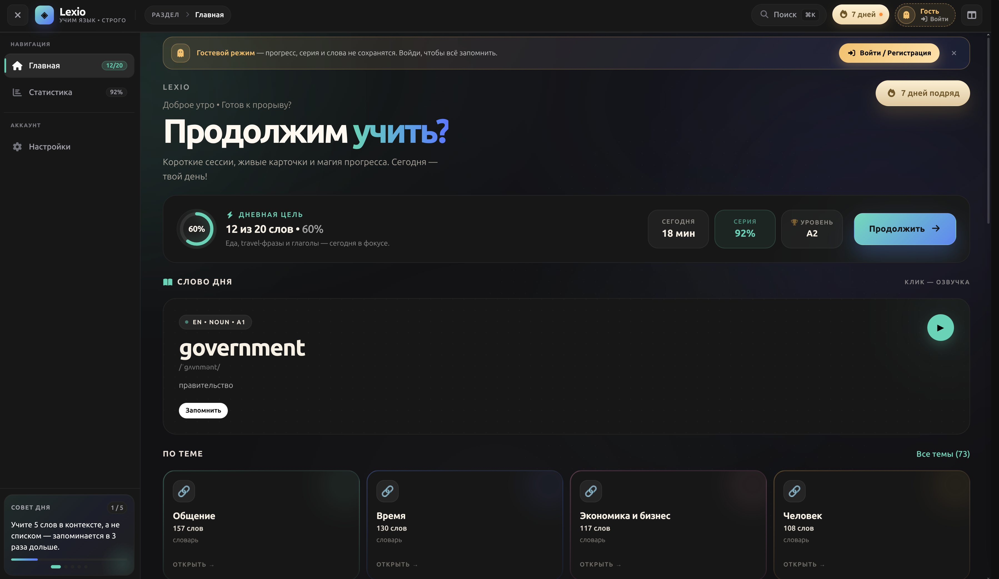
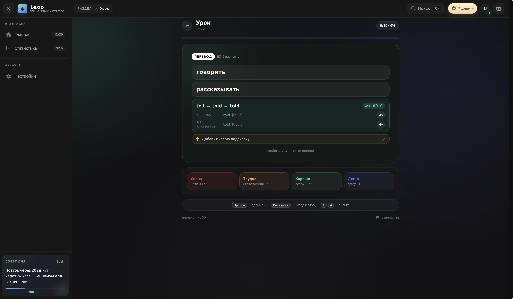

<p align="center">
  <span style="font-size:52px;font-weight:900;background:linear-gradient(135deg,#5AD4B5 0%,#5B74FF 100%);-webkit-background-clip:text;background-clip:text;color:transparent;">◈ LEXIO API</span>
  <br/>
  <span style="font-size:20px;color:#94a3b8;">Backend · Laravel 13 · модульный монолит</span>
</p>

<p align="center">
  
  
  
  
</p>

<p align="center">
  
  
  
</p>

> REST API языкового тренажёра **Lexio**. Модульный манолит: Auth, Catalog, Learning, Library, User. Запускается в docker-стеке из [репозитория `infractructure`](https://github.com/Bogopodob/lexio_infractructure) — отдельно поднимать Dockerfile не нужно.

---

## 🖼️ Интерфейс приложения

<div align="center">
  
  <br/><br/>
  
  <br/><br/>
  
  <br/><br/>
  
  <br/>
</div>

> Нажми на скриншот — откроется в полном размере (~3600px).

Словари с переводами, интервальные повторения, достижения, серии, фразы, медиа и звук — всё это обслуживает единый API на Laravel:

- **JWT-аутентификация** (пароль + email-OTP), токены доступа;
- **Каталог**: словари по языкам и категориям, поиск, word-of-the-day, квиз-раунды;
- **Обучение**: профили языков (target/native), карточки, ревью, цели, достижения, статистика, еженедельная активность, лидерборд;
- **Библиотека**: личные карточки/фразы, медиа, озвучка и транскрибация, расшаривание контента;
- **Профиль**: аватар, друзья, подписка premium.

---

## 🧱 Модули

| Модуль | Префикс | Содержимое |
|---|---|---|
| `Auth` | `/auth` | register, login, email-code, verify, me, logout |
| `Catalog` | `/catalog` | languages, categories, entries, search, word-of-day, quiz-round |
| `Learning` | `/learning/users/{id}/profiles/{id}` | карточки, сессии, ревью, цели, достижения, stats, weekly |
| `Library` | `/library/users/{id}` | личные entries/phrases, media, speak/transcribe, shares |
| `User` | `/users/{id}` | профиль, avatar, друзья, leaderboard, search |

## ⚙️ Консольные команды

```bash
php artisan migrate                    # весь каталог + сидеры + импорты — одним запуском
php artisan db:seed                    # сидеры всех модулей (languages/categories/achievements)
php artisan catalog:import-words       # импорт словарей из storage/.../words/*.csv|xlsx
php artisan catalog:import-phrases     # фразы из worlds.md
php artisan catalog:import-irregular-verbs
php artisan catalog:clean-data --fix   # очистка и нормализация данных
php artisan user:grant-premium         # выдать premium-доступ пользователю
```

> 💡 **Одна миграция вместо десятков команд.** `2026_09_16_000000_seed_modules_and_run_commands::up()` сам запускает все сидеры модулей и тяжёлые импорты (с живым пофайловым прогрессом) — после `migrate` база полностью готова, без шаманства.

---

## 🚀 Как запустить

### Стек (рекомендуется)

Backend собирается и живёт внутри docker-стека из отдельного репозитория [lexio_infractructure](https://github.com/Bogopodob/lexio_infractructure):

```bash
git clone git@github.com:Bogopodob/lexio_backend.git
git clone git@github.com:Bogopodob/lexio_infractructure.git
cd infractructure

make up                      # dev-стек (php + vite + nginx + postgres + rabbitmq + xdebug)
make backend-shell           # шелл в php-контейнер → дальше php artisan ...
```

Прод-стек — тот же репозиторий, без dev-сервисов:

```bash
docker compose --env-file .env -f docker-compose.yml up -d --build
```

### Локально (без Docker)

```bash
composer install
cp .env.example .env && php artisan key:generate

# в .env: DB_HOST=127.0.0.1, DB_DATABASE=lexio, DB_USERNAME=lexio, DB_PASSWORD=<твой пароль>
composer run setup           # install + key + migrate (+ npm build фронта)
# или вручную:
php artisan migrate --force && php artisan db:seed --force

php artisan serve            # http://localhost:8000
```

### Окружение

Ключевые переменные `backend/.env`:

| Переменная | Значение по умолчанию | Комментарий |
|---|---|---|
| `DB_HOST` | `lexio_postgres` | имя контейнера postgres |
| `DB_DATABASE` / `DB_USERNAME` | `lexio` / `lexio` | — |
| `CORS_ALLOWED_ORIGINS` | `http://localhost:8080,http://localhost:5173` | Vite 5173, или `http://app.lexio.curatio.space:81` |
| `MAIL_MAILER` | `log` | заменить на SMTP перед продакшеном |
| `QUEUE_CONNECTION` | `database` | очередь заказов/сессий |

---

## 🔗 Ссылки

| Репозиторий | Назначение |
|---|---|
| [lexio_backend](https://github.com/Bogopodob/lexio_backend) | этот проект |
| [lexio_frontend](https://github.com/Bogopodob/lexio_frontend) | SPA на React (порт 5173) |
| [lexio_infractructure](https://github.com/Bogopodob/lexio_infractructure) | docker-compose dev/prod, Makefile, deploy.sh |

---

<p align="center">
  <span style="color:#5ad4b5;">◈</span> <span style="color:#94a3b8;">Lexio API — обратная сторона красивой выучки</span>
</p>